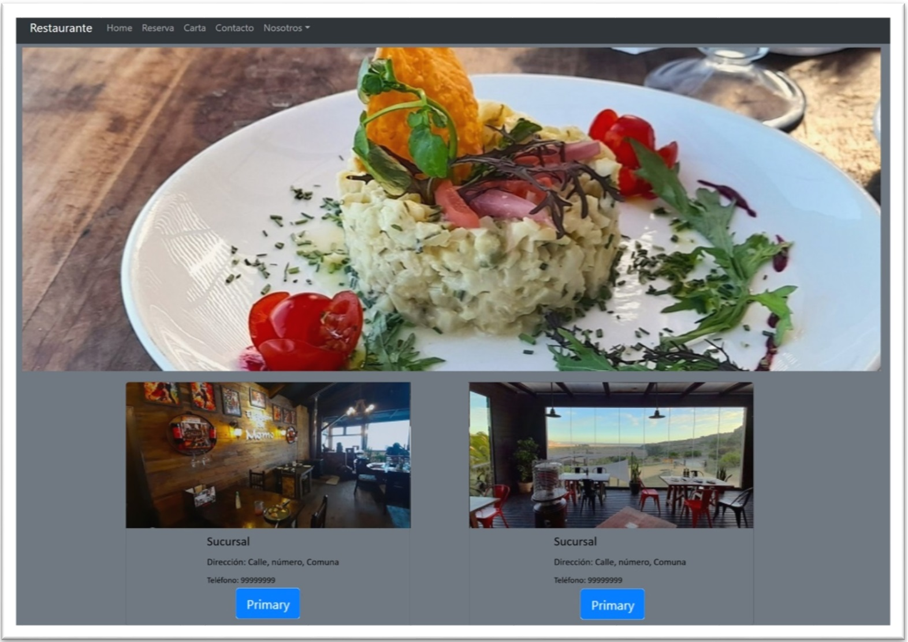
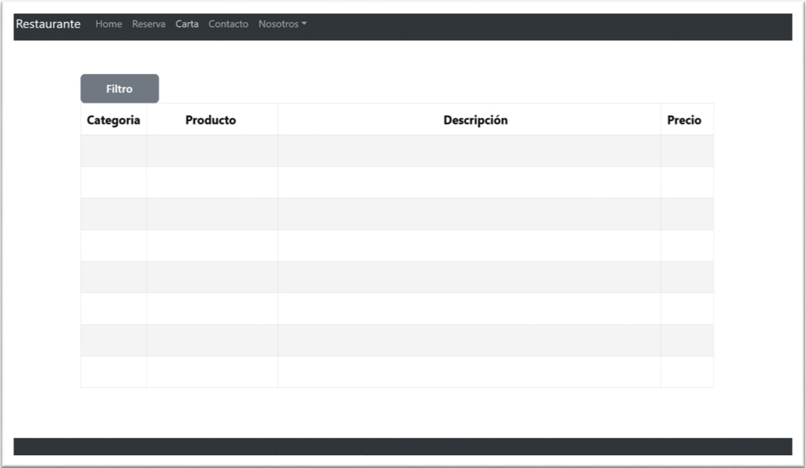

## Proyecto 4: Aplicación de Restaurante APP.
El proyecto consiste en la elaboración de un sitio Web de un restaurant, el cual permita a los clientes, ver el menú del
restaurant, realizar reservas y comentarios en blog de lo que opinan del restaurante. Para ello se utilizaron tecnologías
como Firebase como almacén en la nube de la base de datos del restaurant, y React para la construcción de las
interfaces de usuario, y GitHub Pages para la publicación del sitio.

### URLs:
**Web Restaurant** <https://cristian-aliaga.github.io/Proyecto4>

**Proyecto GitHb** <https://github.com/cristian-aliaga/Proyecto4>
### Instalación:
- npm install
- npm install react-router-dom
- npm install react-bootstrap bootstrap
- npm install gh-pages
- npm install nodemon
- npm install firebase
- npm install env-cmd

## Prototipo

### Layout: 

1. Home:
2. Reserva: En construcción.
3. Carta/Menú: Despliega información del menú con un filtro con categoría.
4. Contacto: Permite realizar una consulta, sugerencia o reclamo.
5. Nosotros/Suscursales/Blog: Información About Us, ubicación de las sucursales, y un blog con comentarios de los usuarios.

>Nota:
>>Reserva presenta problemas.
